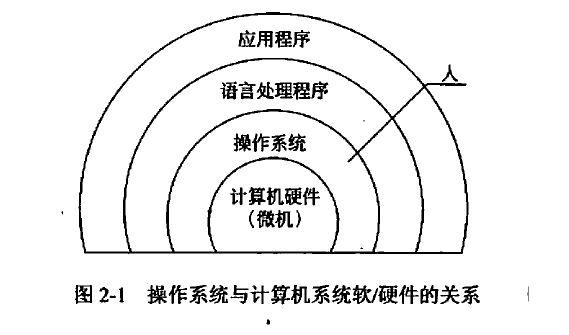

---

---

# C2计算机与网路基础知识

## 2.1 操作系统基础知识

> 操作系统既有效地组织和管理系统中的各种软硬件资源，合理地组织计算机系统的工作流程，又控制程序的执行，并且为用户使用计算机提供一个良好的环境和友好的接口，从而使用户能充分利用计算机资源，提高系统的效率。

### 操作系统

1. 操作系统与计算机系统软/硬件的关系

   

2. 操作系统的分类

   单用户操作系统和批处理操作系统；分时操作系统和实时操作系统；网络操作系统和分布式操作系统；嵌入式操作系统

3. 操作系统特征

   - 并发性
   - 共享性
   - 虚拟性
   - 不确定性

4. 操作系统功能

   - 进程管理
   - 文件管理
   - 存储管理
   - 设备管理
   - 作业管理

### 进程

1. 概念

   > 进程是资源分配和独立运行的基本单位。

   进程是程序的一次执行，通常由程序、数据及进程控制块（PCB，Process Control Block）组成。

   进程控制块描述了进程的基本情况，是进程存在的**唯一标志**。

   进程的分类：系统进程和用户进程；父进程和子进程。

   程序和进程的区别：程序是静态的指令序列，进程是为执行程序的线程保留的资源集。

2. 状态与控制

   

